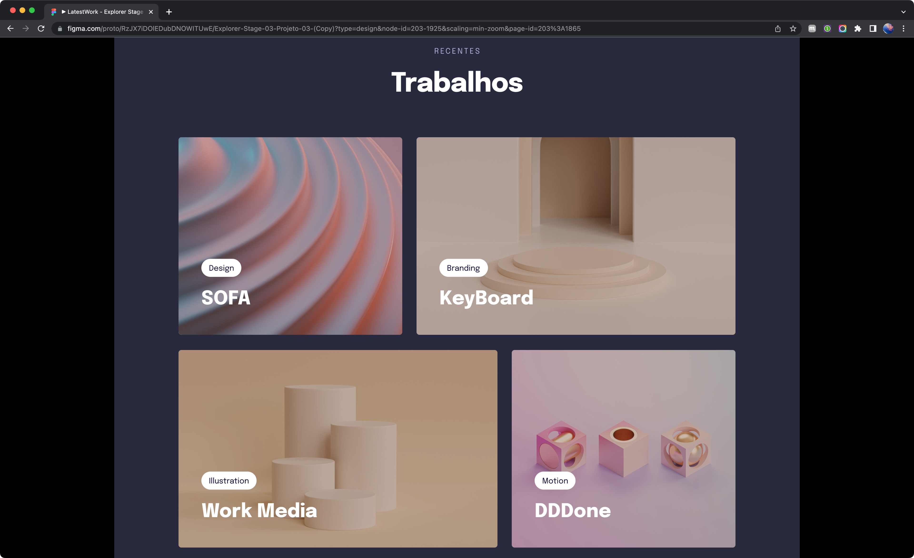

🇺🇸
## 💻 PROJECT
This is the responsive webpage of a furniture designer, based on a layout provided by Rocketseat.
On this project I had the opportunity to learn and practice a lot about the concept of mobile first and responsiveness.
This was my first time using display grid and setting up the responsiveness of texts and areas.
The usage of variables blew my mind!

## 🚀 TECH
This project was developed using the following technologies:
- HTML
- CSS
- Git e GitHub

## 🖌 LAYOUT
I developed e new design based on the one provided by Rocketseat. You can check out the original layout [clicking here](https://www.figma.com/file/RzJX7iDOlEDubDNOWITUwE/Explorer-Stage-03-Projeto-03-(Copy)?type=design&node-id=203%3A1865&t=uyTKtbGXLiJacoRl-1).
A [Figma](https://www.figma.com/) account is required.
 

 

🇧🇷
## 💻 PROJETO
Este é um projeto responsivo da webpage de um designer de móveis, baseado em um layout fornecido pela Rocketseat.
Neste projeto eu tive a oportunidade de aprender e práticar bastante o conceito de "mobile first" e responsividade.
Esta foi a minha primeira vez utilizando o display grid e configurando a responsividade de textos e áreas.
O uso de variáveis me deixou de queixo caído.

## 🚀 TECNOLOGIAS
Este projeto foi desenvolvido utilizando as seguintes tecnologias:
- HTML
- CSS
- Git e GitHub

## 🖌 LAYOUT
Eu desenvolvi um novo layout baseado no original fornecido pela Rocketseat. Você pode conferir o layout original [clicando aqui](https://www.figma.com/file/RzJX7iDOlEDubDNOWITUwE/Explorer-Stage-03-Projeto-03-(Copy)?type=design&node-id=203%3A1865&t=uyTKtbGXLiJacoRl-1).
É necessário ter uma conta no [Figma](https://www.figma.com/).
 

 

## ORIGINAL LAYOUT

